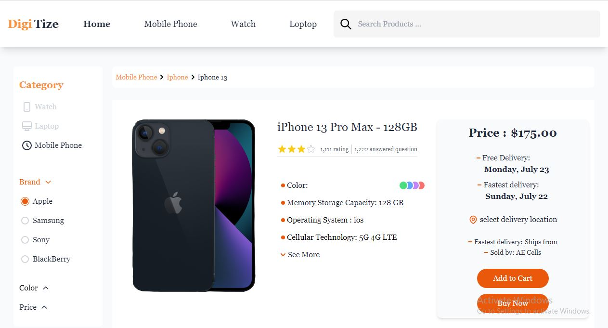

# Shop-English
This Project is written by Mahsa Tabesh

This project is responsive beautifully by using tailwind css.

## Home Page
 * hover items of menu
 * click on circle color
 * hover and select items in sidebar section.

## Single Product
pic

 * click on "See More" for appearing more items.
 * click on "Add to Cart" button So inactive it and it's written will be change to "In Cart".
 * click on Star Icon for giving rank to product.
 * click on circle color for choosing color.
 
 pic
 
 * click on Design , Camera , Battery and see description and picture related to them.
 pic
 pic
 pic
 
 *click on "See More" for seeing more description and change "See More" statement to "See Less".
 pic
 
 

