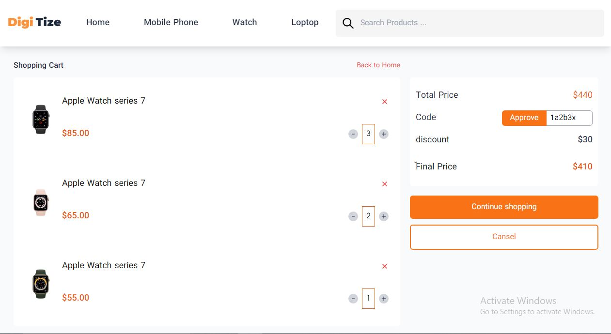

# Shop-English
This Project is written by Mahsa Tabesh

This project is responsive beautifully by using tailwind css.

## Home Page
 * hover items of menu
 * click on circle color
 * hover and select items in sidebar section.

## Single Product

 * click on "See More" for appearing more items.
 * click on "Add to Cart" button So inactive it and it's written will be change to "In Cart".
 * click on Star Icon for giving rank to product.
 * click on circle color for choosing color.
 
 
 
  
 
 * click on Design , Camera , Battery and see description and picture related to them.
 
 
  
  
  
 
 
 -------------------------
 
 * click on "See More" for seeing more description and change "See More" statement to "See Less".
 
 
  
 
 ## Shopping Cart
 
 
 
 * Click on plus, minus, cross icon for increasing, decreasing and deleting products respectively.
 * With changeing number of product, the total price, final price and off will be update simultaneously.
 * If your key code be true, only with one click on "Approve" button the discount will be apply ($5 discount for each product).
 
 
 
 
 
 
 
 

